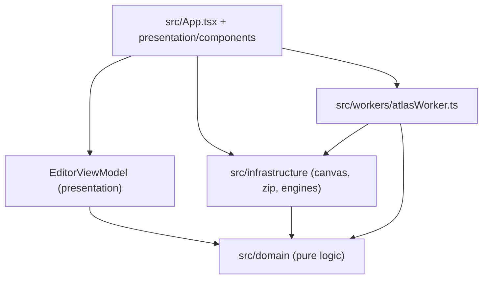
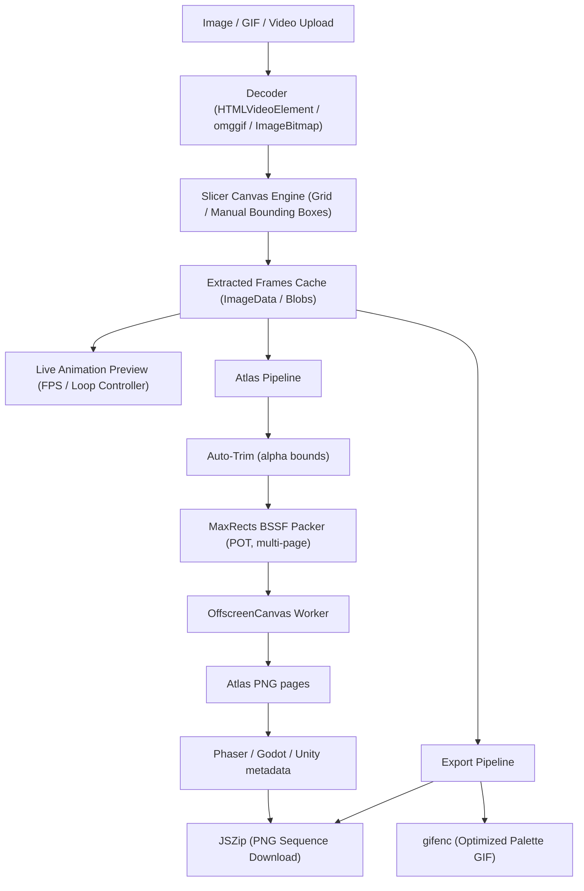

# 🏛️ Architecture & System Design - PixelSlicer

## 📌 1. Project Overview
PixelSlicer is a high-performance web tool for 2D game developers, pixel artists, and animators to slice sprite sheets, extract video frames, pack trimmed sprites into texture atlases, and export optimized GIF/ZIP/Engine bundles.

## 🛠️ 2. Technology Stack
- **Framework**: React 18 with TypeScript
- **Bundler**: Vite
- **Animation & UI**: Framer Motion, Lucide React
- **GIF Encoding/Decoding**: `gifenc`, `omggif`
- **ZIP Packaging**: `JSZip`
- **Offthread rendering**: Web Workers + `OffscreenCanvas` (with a main-thread fallback)
- **Tests**: Vitest

## 🧩 3. Layering
The codebase follows a strict four layer structure. Dependencies always point inwards:



- **domain**: framework free, side effect free, fully unit tested. `FrameLogic` (grid/manual frames), `video/*`, `atlas/*`.
- **infrastructure**: everything that touches the browser (canvas, JSZip, workers, engine descriptors).
- **presentation**: `EditorViewModel` (observable state) and React components.
- **workers**: one entry point per long running job, always delegating to shared infrastructure code.

## 📐 4. Data Processing Architecture



## 📂 5. Project Layout
```text
src/
├── App.tsx                          # Layout, canvas rendering, export handlers
├── main.tsx                         # React entry point
├── components/
│   ├── FrameThumbnail.tsx           # Single frame thumbnail
│   └── GallerySection.tsx           # Frame gallery strip
├── domain/
│   ├── FrameLogic.ts                # Frame, grid math, resize/drag rules
│   ├── video/                       # VideoFile, validation, presets
│   └── atlas/
│       ├── AtlasTypes.ts            # Rect/Pivot/layout/option contracts
│       ├── AtlasTrim.ts             # Alpha bounding boxes (auto-crop)
│       ├── AtlasPivot.ts            # Origin presets, click -> pivot mapping
│       ├── AtlasPacker.ts           # MaxRects BSSF bin packing, POT growth
│       └── AtlasLayout.ts           # trim + pivot + pack orchestration
├── infrastructure/
│   ├── ExportService.ts             # PNG / sprite sheet / GIF export
│   ├── GifService.ts                # omggif decoding
│   ├── video/                       # Frame extraction and grid building
│   └── atlas/
│       ├── AtlasPipeline.ts         # Shared trim + pack + rasterize routine
│       ├── AtlasRenderer.ts         # Canvas drawing (works on both canvas types)
│       ├── AtlasWorkerProtocol.ts   # Structured-clone request/response types
│       ├── AtlasWorkerClient.ts     # Worker lifecycle + main-thread fallback
│       ├── AtlasMetadataExporters.ts# Phaser / Godot / Unity descriptors
│       └── AtlasExportService.ts    # ZIP bundle assembly
├── presentation/
│   ├── EditorViewModel.ts           # Observable editor + atlas/pivot state
│   ├── tokens.ts
│   └── components/                  # VideoUploader, AtlasExporter modals
├── workers/
│   └── atlasWorker.ts               # OffscreenCanvas atlas builder
├── hooks/                           # Thumbnails, uploads, config storage
├── i18n/                            # tr / en strings
├── styles/                          # main, video-uploader, atlas
└── testUtils/                       # Shared test fixtures (pixels, canvas)
```

## 🧪 6. Testing Strategy
`npm test` runs Vitest in a Node environment. Everything that can be pure, is pure:

| Suite | Focus |
| --- | --- |
| `AtlasTrim.test.ts` | Alpha bounds, thresholds, frame clipping |
| `AtlasPivot.test.ts` | Origin presets, normalization, click mapping |
| `AtlasPacker.test.ts` | Placement, overlaps, POT growth, multi-page splits |
| `AtlasLayout.test.ts` | Padding/extrude invariants, page limits, pivot keying |
| `AtlasMetadataExporters.test.ts` | Exact JSON / `.tres` output per engine |
| `AtlasRenderer.test.ts` | Draw geometry and extrude rings against a fake canvas |
| `AtlasWorkerClient.test.ts` | Worker protocol, transferables, fallbacks |
| `AtlasExportService.test.ts` | ZIP bundle contents |

Canvas and Worker APIs are replaced by fixtures from `src/testUtils`, so the suite runs without a browser.
