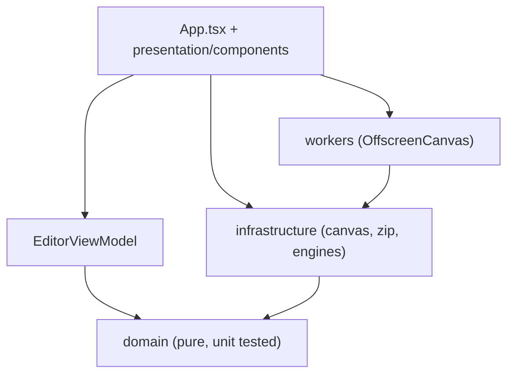

# 🤖 Architecture Overview (Auto-Generated)

> ⚡ **THIS FILE WAS AUTOMATICALLY GENERATED BY `npm run docs:arch`.**  
> **Project Name**: `pixelslicer`  
> **Version**: `2.3.0`  
> **Generated Date**: `2026-09-27`

Do not edit by hand: change the source tree and re-run
`node scripts/generate-architecture-report.mjs`.

---

## 📌 1. Executive Summary & Metrics

This document provides an automated architectural overview of the application source code structure.

### 📊 Codebase Statistics
- **Total source files**: `76`
- **Total lines of code (non-empty)**: `11116`
- **UI components (.tsx)**: `13`
- **Custom hooks**: `7`
- **Domain modules**: `15`
- **Infrastructure & worker modules**: `25`
- **Presentation modules**: `12`
- **Test files**: `20`
- **Style sheets**: `3`

### 🛠️ Key Technology Stack
- `framer-motion`
- `gifenc`
- `jszip`
- `omggif`
- `react`
- `react-dom`
- `@testing-library/dom`
- `@testing-library/react`
- `@types/omggif`
- `@types/react`
- `@types/react-dom`
- `@vitejs/plugin-react`
- `@vitest/coverage-v8`
- `happy-dom`
- `typescript`
- `vite`
- `vitest`

---

## 🗺️ 2. Architectural Flow Diagram



---

## 📂 3. `src/` Directory Tree

```text
src/
├── App.tsx
├── assets/
│   ├── logo.png
│   └── logo2.png
├── components/
│   ├── FrameThumbnail.tsx
│   ├── GallerySection.test.tsx
│   └── GallerySection.tsx
├── domain/
│   ├── FrameLogic.test.ts
│   ├── FrameLogic.ts
│   ├── atlas/
│   │   ├── AtlasLayout.test.ts
│   │   ├── AtlasLayout.ts
│   │   ├── AtlasPacker.test.ts
│   │   ├── AtlasPacker.ts
│   │   ├── AtlasPivot.test.ts
│   │   ├── AtlasPivot.ts
│   │   ├── AtlasTrim.test.ts
│   │   ├── AtlasTrim.ts
│   │   └── AtlasTypes.ts
│   └── video/
│       ├── Video.test.ts
│       ├── Video.ts
│       ├── VideoValidation.test.ts
│       └── VideoValidation.ts
├── hooks/
│   ├── useDragAndDrop.ts
│   ├── useEditorSelector.test.tsx
│   ├── useEditorSelector.ts
│   ├── useFrameThumbnails.test.tsx
│   ├── useFrameThumbnails.ts
│   ├── useVideoConfigStorage.ts
│   └── useVideoUpload.ts
├── i18n/
│   ├── translations.ts
│   └── useI18n.ts
├── infrastructure/
│   ├── ExportPipeline.test.ts
│   ├── ExportPipeline.ts
│   ├── ExportService.test.ts
│   ├── ExportService.ts
│   ├── FrameExportProtocol.ts
│   ├── FrameExportWorkerClient.test.ts
│   ├── FrameExportWorkerClient.ts
│   ├── GifService.ts
│   ├── ImageLoader.test.ts
│   ├── ImageLoader.ts
│   ├── atlas/
│   │   ├── AtlasExportService.test.ts
│   │   ├── AtlasExportService.ts
│   │   ├── AtlasMetadataExporters.test.ts
│   │   ├── AtlasMetadataExporters.ts
│   │   ├── AtlasPipeline.ts
│   │   ├── AtlasRenderer.test.ts
│   │   ├── AtlasRenderer.ts
│   │   ├── AtlasWorkerClient.test.ts
│   │   ├── AtlasWorkerClient.ts
│   │   └── AtlasWorkerProtocol.ts
│   └── video/
│       ├── VideoFrameExtractor.ts
│       ├── VideoFrameGridService.ts
│       └── VideoUploadService.ts
├── main.tsx
├── presentation/
│   ├── EditorViewModel.animation.test.ts
│   ├── EditorViewModel.lifecycle.test.ts
│   ├── EditorViewModel.ts
│   ├── components/
│   │   ├── AtlasExporter/
│   │   │   ├── AtlasExporterModal.tsx
│   │   │   └── index.ts
│   │   └── VideoUploader/
│   │       ├── DropZone.tsx
│   │       ├── UploadErrorToast.tsx
│   │       ├── UploadProgress.tsx
│   │       ├── VideoPreview.tsx
│   │       ├── VideoUploader.tsx
│   │       └── index.ts
│   └── tokens.ts
├── styles/
│   ├── atlas.css
│   ├── main.css
│   └── video-uploader.css
├── testUtils/
│   ├── canvasFixtures.ts
│   ├── pixelFixtures.ts
│   └── setupTests.ts
├── types/
│   └── gifenc.d.ts
├── utils/
│   └── scheduler.ts
└── workers/
    ├── atlasWorker.ts
    └── frameExportWorker.ts
```

---

## 📋 4. Layer Breakdown

| Directory | Purpose | File Count |
| :--- | :--- | :--- |
| `src/` | Application shell and entry point | 2 |
| `src/assets/` | Static assets | 2 |
| `src/components/` | Gallery and thumbnail components | 3 |
| `src/domain/` | Pure domain logic: grid frames, video, atlas | 2 |
| `src/domain/atlas/` | Auto-trim, pivot, bin packer, atlas layout (pure) | 9 |
| `src/domain/video/` | Video file types, limits and validation (pure) | 4 |
| `src/hooks/` | Thumbnail, upload and storage hooks | 7 |
| `src/i18n/` | tr / en translation strings | 2 |
| `src/infrastructure/` | Browser facing services: canvas, gif, image loading | 10 |
| `src/infrastructure/atlas/` | Atlas renderer, worker client, engine exporters | 10 |
| `src/infrastructure/video/` | Frame extraction, grid building, upload | 3 |
| `src/presentation/` | EditorViewModel, design tokens | 4 |
| `src/presentation/components/AtlasExporter/` | Source modules | 2 |
| `src/presentation/components/VideoUploader/` | Source modules | 6 |
| `src/styles/` | CSS variables and component styles | 3 |
| `src/testUtils/` | Shared test fixtures (pixels, canvas) | 3 |
| `src/types/` | Ambient module declarations | 1 |
| `src/utils/` | Scheduling helpers | 1 |
| `src/workers/` | Web Worker entry points | 2 |

---

## ⚙️ 5. Maintainability & Code Conventions

1. **Layered architecture**: UI never contains business logic; `domain` never imports React or the DOM.
2. **Type safety**: strict TypeScript, `noUnusedLocals` and `noUnusedParameters` are on.
3. **Testability**: pure functions live in `domain` and are unit tested; browser APIs are stubbed in `src/testUtils`.

---
*Auto-generated by `npm run docs:arch` for `pixelslicer` 2.3.0 on 2026-09-27.*
